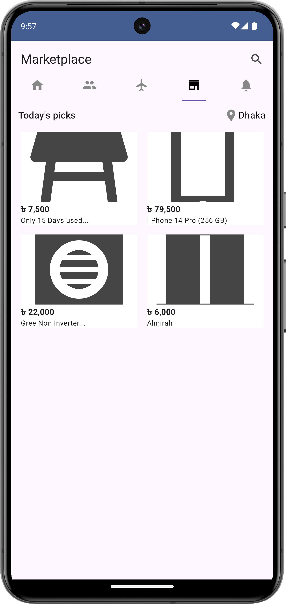

# Jetpack-Compose-app

A modern Android feed application that displays posts with smooth scrolling, pull-to-refresh, offline support, and efficient image loading. Built with Jetpack Compose components, Retrofit, Room, and Hilt.

## Screenshots 📸

  
  
  
  

## Features ✨
- **Dynamic Feed**: Scrollable list of posts with declarative UI using Jetpack Compose
- **Pull-to-Refresh**: Swipe down to fetch latest content
- **Offline Support**: Caches data locally using Room
- **Fast Image Loading**: Coil for efficient thumbnail handling for coroutine
- **Clean Architecture**: MVVM with ViewModel/LiveData
- **Dependency Injection**: Hilt for simplified DI

## Tech Stack 🛠️
| Category          | Components                                                                |
|-------------------|---------------------------------------------------------------------------|
| Core              | Kotlin Compose, Coroutines, Jetpack, Flow                                 |
| UI                | Material Design, Compose LazyColumn, CardView, SwipeRefreshLayout         |
| Networking        | Retrofit 2 + GSON                                                         |
| Image Loading     | Coil                                                                      |
| Local Database    | Room (with Kotlin coroutine support)                                      |
| DI                | Hilt                                                                      |
| Testing           | Espresso                                                                  |

┌────────────────┐   ┌────────────────┐   ┌────────────────┐
│    UI Layer    │ ← │  ViewModel     │ ← │  Repository    │
└────────────────┘   └────────────────┘   └────────────────┘
                                           ↑           ↑
                                           │           │
                                ┌───────────┘   ┌───────┴───────┐
                                │               │               │
                        ┌────────────────┐ ┌────────────────┐ ┌────────────────┐
                        │  Remote Data   │ │  Local Cache   │ │  Other Data    │
                        │  (Retrofit)    │ │  (Room)        │ │  Sources       │
                        └────────────────┘ └────────────────┘ └────────────────┘
